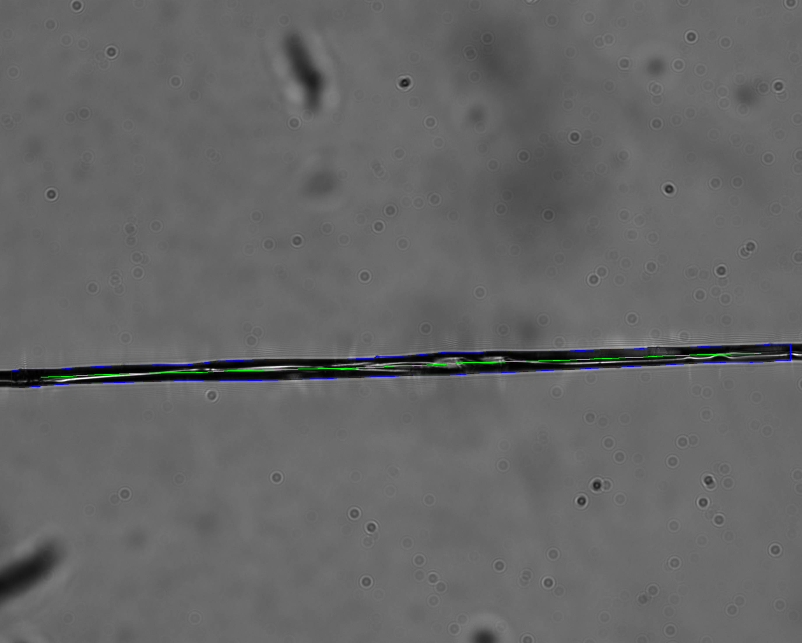
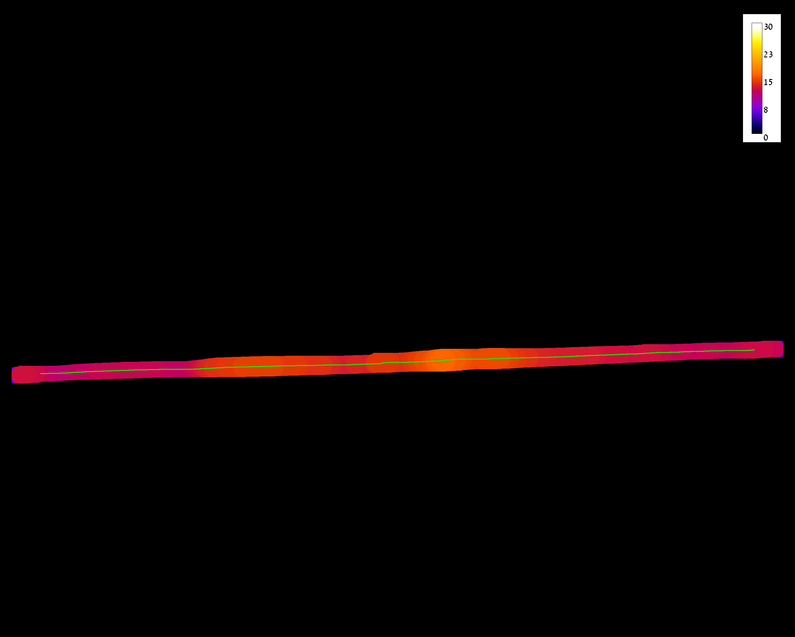

# Measure local thickness of silk fiber or film    

## Overview

Measure Fiber or Film thichness by measuring Local Thickness along the center line of a single horizontal fiber or film

This macro was used in:     

	<strong>Metal Ions Guide the Production of Silkworm Fibers </strong>   
	

	

	<strong>Ori Brookstein, Eyal Shimoni, Dror Eliaz, Ifat Kaplan-Ashiri, Itay Carmel, Ulyana Shimanovich </strong>   
	

Software package:  Fiji (ImageJ)
Workflow language: ImageJ macro

By Ofra Golani, MICC Cell Observatory, Weizmann Institute of Science, March 2020

	

It assumes that the samples are horizontaly posioned
  
## Workflow

The macro allow procewssing of single file or whole folder. 

1. Scale the image to correct units (assuming the width of the image is equal to imRealLength um)
2. Segment the film into binary image
	- Apply background subtraction using rolling ball - this is optional step , that is used by default. 
  	  for this it is important to set MaxEstimatedWidthUm correctly. the rolling ball size is set to MaxEstimatedWidthUm+10 
  	  it is especially important when you use AutoThreshold. 
	- Use either AutoThreshold (Li) or fixed threshold (0-MaxFilmIntensity) 
  	 note that the fixed threshold values need to change if you use background subtraction
3. Measure the local thickness of the binary image
4. Find center line of the film 
	- Erode the binary film - to achieve better skeletonization, 
  	  nErode value can be set in 3 ways controled by setErodeValStrategy: 
	- fixed value (nDefaultErode)
 	- the maximum between (Mean LocThick - 2* Std LocThk)/3  && MinLocThick/3
 	- fixed value or the above value if the default fixed value is smaller
 	  by default use nDefaultErode (=20 pixels), but lower this value to (Mean LocThick - 2* Std LocThk)/3 for thinner films 
 	- Skeletonize
 	- Discard skeleton areas that are up to ignoreBorderSize percent from the image border, 
 	  if ignoreTopDown=0 , only side borders are ignored, =1: both side and top/bottom borders of the image are ignored
 	- Discard (most of) the perpendicular skeleton segments by: 
 		breaking the skeleton at branch points, 
 		discarding skeleton segments smaller than MinSkeletonArea (usually perpendicular), 
 		optionally discard segments that are oriented between minAngleToFilter and maxAngleToFilter ,
 		NOTE: it is valid to use the above only if the films were always imaged at horizontal orientation 
 		this is controled by filterByAngle
5. Measure Mean/Median/Modal/Min/Max of Local thickness along the remaining skeleton segments,  
   which are assumed to be good approximation for the centerline 
6. Write summary line 
7. Save quality control images with overlay of the skeleton segments used for measurement, 
   on top of the original image and the local thickness image

8. Add Mean/Std/Min/Max lines for the summary table
 
  	
## Output

For each input image FN, the following output files are saved in ResultsSubFolder under the input folder
- FN_OrigOverlay.tif 	- the original image with overlay of the segmented film in blue
- FN_LocThk.tif			- local thickness measurement (values are in um), you can inspect them if you open the file in Fiji
 	  						  Maximum displayed value is set to MaxEstimatedWidthUm for all images to alloow visual comparison
- FN_LocThkOverlay.tif 	- local thickness with overlay of the skeleton segments
- FN_SkelSegmentsResults.xls - the detailed measurements for each skeleton segment in the image  
- FN_SkelSegmentsRoiSet.zip  - the skeleton segments used for measurements
 
Overlay colors can be controled by BoundaryColor and CenterlineColor
 
Summary.xls  - Table with one line for each input image files with average values of Mean and Median LocTchikness
FilmThicknessParameters.txt - Parameters used during the latest run
 
## Dependencies
Fiji with ImageJ version > 1.52s (Check Help=>About ImageJ, and if needed use Help=>Update ImageJ...
It is based on LocalThickness ImageJ plugin: https://imagej.net/Local_Thickness, by Bob Dougherty
Please cite Fiji (https://imagej.net/Citing) and LocalThickness if you use it for publication
 
##  Usage Instructions
NOTE: Before running the macro, go through the images and discard images that do not really contain film segments, 
      so that they will not be included in the folder statistics
 
- Drag and drop the macro to Fiji, click Run
- Set Process mode to singleFile or wholeFolder
- Select a file to process, if wholeFolder is selected: all the files in the folder of the selected file are processed
- If batchModeFlag is selected (recomended) the macro will run faster and not dispalyed temporary images
 
NOTE: It is very important to inspect All quality control images to verify that segmentation and centerline are correct 
  
